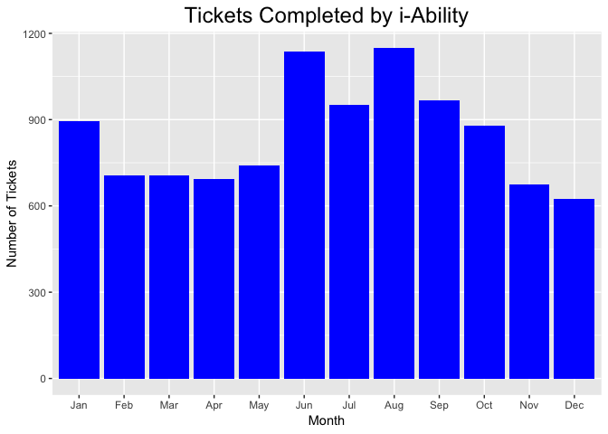
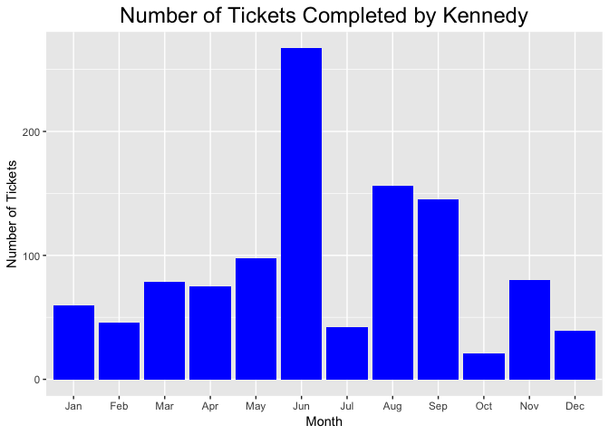

Metrics for Avatar Help Desk and SFDPH In-House Ticketing System
================

This project attempts to automate the process of running metrics for the Avatar Help Desk. The code can also be easily adjusted to run metrics on any other application supported by the in-house SFDPH ticketing system.

I am currently working on a way to anonymize the dataset for the privacy of staff who use the ticketing system and end-users of supported applications.

The Metrics for Avatar Help Desk
--------------------------------

The code for plots is separated into two files: overallplots (plots that look at groups) and individual plots (those that look at individual technical support staff.)

In the first set of plots, we can compare how many tickets the RAMS i-Ability program was able to complete over the course of the year.

``` r
require(ggplot2)
```

    ## Loading required package: ggplot2

``` r
ggplot(data = subset(tickets.iability,
                     !is.na(MonthofCloseDate)), aes(x=MonthofCloseDate)) +
  geom_bar(fill = "blue") + 
  ylab("Number of Tickets") + 
  xlab("Month") +
  ggtitle("Tickets Completed by i-Ability") +
  theme(plot.title = element_text(hjust=0.5, size=18))
```



In the second file, the name of a specific support person can be given...

``` r
ia.name <- "Kennedy"
```

... and the plot will show the number of tickets that s/he completed over the course of the year.

``` r
require(ggplot2)

ggplot(data = subset(individual.tickets, !is.na(MonthofCloseDate)), aes(x=MonthofCloseDate)) +
  geom_bar(fill = "blue") + 
  ylab("Number of Tickets") + 
  xlab("Month") +
  ggtitle(paste0("Number of Tickets Completed by ", ia.name)) +
  theme(plot.title = element_text(hjust=0.5, size=18))
```


